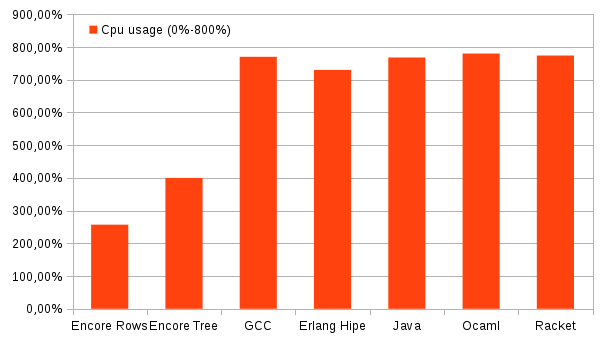
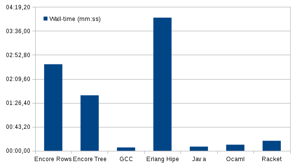

All of these test where performed on a Intel Core i7-950 (4 physical cores, 8 logical cores), 8 GB of RAM and
running XUbuntu 14.10 (Linux 3.16.0-30-generic). All tests where performed with the same background processes running.
Each program was run three times with the same parameters.

CPU usage
---


This plot shows the cpu usage of the different implementations. 800% corresponds to full utilization of all cores.


Wall-time
===


This plot shows the actual time (wall time) each of the programs took.


Results
===


Command used for timing:
```
/usr/bin/time -f '%C\nwall-time: %E\nuser-time: %U \nsystem-time: %S\nload: %P' PROGRAM TO BE RUN > out.pbm
```


Encore rows
---

This version of the encore program creates one active object per row of the plot.
Each object for the row is created sequentially but the computation is performed concurrently.
```
./mbr --ponythreads 8 16000
wall-time: 2:36.83
user-time: 382.99 
system-time: 20.94
load: 257%

./mbr --ponythreads 8 16000
wall-time: 2:37.68
user-time: 386.82 
system-time: 20.48
load: 258%

./mbr --ponythreads 8 16000
wall-time: 2:37.48
user-time: 386.03 
system-time: 20.25
load: 257%
```

Encore Tree
---
This version of the encore program divides the plot region into halves (on the imaginary axis) and plots.
The tree structure is generated recursively and concurrently. Each "leaf" of the tree then performs the 
computation of the Mandelbrot set in parallel and all leaves write the results asynchronously to the same array.
The printout isn't performed until all of the leaves are done. The second command line argument is the depth of the tree.

```
./mbr-tree --ponythreads 8 16000 10
wall-time: 1:36.76
user-time: 395.92 
system-time: 8.11
load: 417%

./mbr-tree --ponythreads 8 16000 10
wall-time: 1:44.53
user-time: 349.72 
system-time: 9.88
load: 344%

./mbr-tree --ponythreads 8 16000 10
wall-time: 1:24.93
user-time: 384.59 
system-time: 7.65
load: 461%
``` 

GCC C
---
```
./gcc9 16000
wall-time: 0:05.80
user-time: 45.48 
system-time: 0.04
load: 783%

./gcc9 16000
wall-time: 0:05.97
user-time: 45.33 
system-time: 0.04
load: 758%

./gcc9 16000
wall-time: 0:05.87
user-time: 45.39 
system-time: 0.03
load: 772%
```

Erlang Hipe
---
```
erl -smp enable -noshell -run mandelbrot main 16000
wall-time: 3:56.21
user-time: 1719.05 
system-time: 7.13
load: 730%

erl -smp enable -noshell -run mandelbrot main 16000
wall-time: 4:00.59
user-time: 1748.61 
system-time: 7.53
load: 729%

erl -smp enable -noshell -run mandelbrot main 16000
wall-time: 3:59.08
user-time: 1745.91 
system-time: 7.06
load: 733%
```

Java
---
```
java -server -XX:+TieredCompilation -XX:+AggressiveOpts mandelbrot 16000
wall-time: 0:07.58
user-time: 57.95 
system-time: 0.28
load: 768%

java -server -XX:+TieredCompilation -XX:+AggressiveOpts mandelbrot 16000
wall-time: 0:07.61
user-time: 58.17 
system-time: 0.37
load: 768%

java -server -XX:+TieredCompilation -XX:+AggressiveOpts mandelbrot 16000
wall-time: 0:07.58
user-time: 57.97 
system-time: 0.27
load: 767%
```

OCaml
---
```
./mandelbrot.ocaml_run 16000
wall-time: 0:10.88
user-time: 84.92 
system-time: 0.20
load: 781%

./mandelbrot.ocaml_run 16000
wall-time: 0:11.08
user-time: 86.43 
system-time: 0.19
load: 781%

./mandelbrot.ocaml_run 16000
wall-time: 0:10.88
user-time: 84.96 
system-time: 0.21
load: 782%
```

Racket
---
```
racket mandelbrot.racket-4.racket 16000
wall-time: 0:17.48
user-time: 135.45 
system-time: 0.29
load: 776%

racket mandelbrot.racket-4.racket 16000
wall-time: 0:19.41
user-time: 150.06 
system-time: 0.29
load: 774%

racket mandelbrot.racket-4.racket 16000
wall-time: 0:18.42
user-time: 142.05 
system-time: 0.32
load: 772%
```


